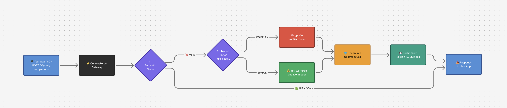
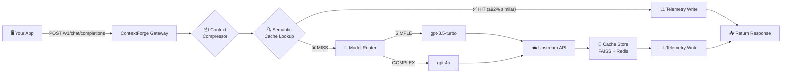

<p align="center">
  
</p>

<h1 align="center">ContextForge</h1>

<p align="center">
  <strong>Cut your LLM API costs by up to 60% — with zero code changes.</strong><br/>
  A drop-in proxy that adds semantic caching, smart model routing, and context compression<br/>
  to any OpenAI-compatible application.
</p>

<p align="center">
  <a href="https://github.com/aayush-1o/contextforge/actions/workflows/ci.yml"></a>
  
  
  
  
</p>

---

## 💡 Why ContextForge?

Most LLM-powered apps send every prompt straight to the most expensive model, even when a cached answer or a cheaper model would do. ContextForge fixes that — transparently.

You point your app at `localhost:8000` instead of `api.openai.com`. Same SDK, same API, same code. Behind the scenes, ContextForge intercepts every request and applies three cost-cutting optimizations before it ever hits a paid API.

|  | **Without ContextForge** | **With ContextForge** |
|--|--------------------------|----------------------|
| 💰 **Cost per request** | Full price, every time | Cached hits are **free**, simple prompts routed to cheaper models |
| ⚡ **Latency on repeat queries** | 500ms–2s (full API round-trip) | **< 30ms** (served from local cache) |
| 🔧 **Code changes needed** | — | **Zero** — just change the base URL |
| 🤖 **Model flexibility** | Hardcoded in your app | Automatic — simple→GPT-3.5, complex→GPT-4o |
| 🔒 **Vendor lock-in** | Tied to one provider | Swap models or providers via config — no code changes |

---

## 🏗️ Architecture


---

## ⚡ How It Works



1. **Your app sends a request** — exactly like it would to OpenAI. No SDK changes, no wrapper code.
2. **Context compression** — if the conversation exceeds the token threshold (default: 2000) and minimum turns (default: 6), older turns are summarized by the LLM to reduce token usage. Skipped for short conversations or when `X-ContextForge-No-Compress: true` is set.
3. **Semantic cache lookup** — the prompt is embedded using all-MiniLM-L6-v2 and searched against FAISS. If a match is found at ≥92% cosine similarity, the cached response is returned in under 30ms.
4. **Smart model routing** — on cache miss, a rule-based classifier analyzes token count and keyword signals. Simple prompts get routed to cheaper models; complex prompts go to the best.
5. **Upstream call** — the request is forwarded to the selected model via the official SDK.
6. **Cache store** — the response is embedded and stored in FAISS + Redis for future lookups.
7. **Telemetry write** — every request is logged to SQLite with model, latency, cost estimate, cache hit status, and compression info.
8. **Response returned** — your app receives a standard OpenAI response, enriched with `X-Cache-Hit`, `X-Model-Tier`, `X-Model-Selected`, `X-Compressed`, and `X-Compression-Ratio` headers.

---

## 🎬 Demo

```bash
# First request — cache miss, routed to gpt-3.5-turbo (simple prompt)
$ curl -s -D- http://localhost:8000/v1/chat/completions \
  -H "Content-Type: application/json" \
  -H "Authorization: Bearer $OPENAI_API_KEY" \
  -d '{"model":"gpt-3.5-turbo","messages":[{"role":"user","content":"What is the capital of France?"}]}' \
  2>&1 | grep -E "^(X-|HTTP)"

HTTP/1.1 200 OK
X-Cache-Hit: false
X-Model-Tier: simple
X-Model-Selected: gpt-3.5-turbo

# Same question again — instant cache hit!
$ curl -s -D- http://localhost:8000/v1/chat/completions \
  -H "Content-Type: application/json" \
  -H "Authorization: Bearer $OPENAI_API_KEY" \
  -d '{"model":"gpt-3.5-turbo","messages":[{"role":"user","content":"What's the capital of France?"}]}' \
  2>&1 | grep -E "^(X-|HTTP)"

HTTP/1.1 200 OK
X-Cache-Hit: true          ← semantically matched (different wording, same meaning)
X-Model-Tier: simple
X-Model-Selected: gpt-3.5-turbo

# Complex prompt — automatically routed to gpt-4o
$ curl -s -D- http://localhost:8000/v1/chat/completions \
  -H "Content-Type: application/json" \
  -H "Authorization: Bearer $OPENAI_API_KEY" \
  -d '{"model":"gpt-3.5-turbo","messages":[{"role":"user","content":"Analyze the time complexity of Dijkstra'\''s algorithm with a Fibonacci heap vs binary heap"}]}' \
  2>&1 | grep -E "^(X-|HTTP)"

HTTP/1.1 200 OK
X-Cache-Hit: false
X-Model-Tier: complex       ← automatically detected
X-Model-Selected: gpt-4o    ← upgraded from gpt-3.5-turbo
```

---

## 📊 Current Status

| Phase | Feature | Status |
|:-----:|---------|:------:|
| 0 | Architecture & Repo Setup | ✅ Complete |
| 1 | Core Proxy (Passthrough) | ✅ Complete |
| 2 | Semantic Cache | ✅ Complete |
| 3 | Model Router | ✅ Complete |
| 4 | Context Compressor | ✅ Complete |
| 5 | Telemetry Layer | ✅ Complete |
| 6 | Adaptive Thresholds & Cache Invalidation | 🔄 In Progress |
| 7 | Testing & Benchmarking Harness | ⏳ Pending |
| 8 | Dockerization & Deployment | ⏳ Pending |
| 9 | Final Documentation & Handoff | ⏳ Pending |

> **`v0.5.0`** · 54/54 tests passing · ruff clean · 1000-prompt benchmark dataset

---

## 🚀 Quick Start

### Prerequisites

- Docker & Docker Compose
- An OpenAI API key

### 1. Clone & Configure

```bash
git clone https://github.com/aayush-1o/contextforge.git
cd contextforge

cp .env.example .env
nano .env   # paste your OPENAI_API_KEY
```

### 2. Start

```bash
docker compose up --build -d
```

### 3. Verify

```bash
curl http://localhost:8000/health
# → {"status":"ok","version":"0.5.0"}
```

### 4. Use It

```python
import openai

client = openai.OpenAI(
    base_url="http://localhost:8000/v1",
    api_key="your-openai-key",
)

response = client.chat.completions.create(
    model="gpt-3.5-turbo",
    messages=[{"role": "user", "content": "What is the capital of France?"}],
)

print(response.choices[0].message.content)
```

That's it. Your existing code works unchanged.

---

## ⚙️ Configuration

All settings live in `.env` (copy from `.env.example`):

| Variable | Description | Default |
|----------|-------------|---------|
| `OPENAI_API_KEY` | Your OpenAI API key | *(required)* |
| `ANTHROPIC_API_KEY` | Your Anthropic API key | `""` |
| `REDIS_URL` | Redis connection string | `redis://localhost:6379` |
| `SIMILARITY_THRESHOLD` | Cosine similarity threshold for cache hits (0.0–1.0) | `0.92` |
| `CACHE_TTL_SECONDS` | How long cached responses live in Redis | `86400` (24h) |
| `PREFERRED_PROVIDER` | Which LLM provider to use: `openai` or `anthropic` | `openai` |
| `LOG_LEVEL` | Logging verbosity: `DEBUG`, `INFO`, `WARNING`, `ERROR` | `INFO` |
| `SQLITE_DB_PATH` | Path for the telemetry SQLite database | `./data/telemetry.db` |
| `FAISS_INDEX_PATH` | Path for the FAISS vector index file | `./data/faiss.index` |
| `OPENAI_BASE_URL` | Override OpenAI API base URL (for proxies/testing) | `https://api.openai.com/v1` |
| `CONTEXT_COMPRESSION_THRESHOLD_TOKENS` | Token count above which compression activates (Phase 4) | `2000` |
| `COMPRESSION_MIN_TURNS` | Minimum conversation turns before compression (Phase 4) | `6` |

---

## 📡 API Reference

### `POST /v1/chat/completions`

OpenAI-compatible chat completions endpoint. Supports both streaming and non-streaming.

**Request:**
```json
{
  "model": "gpt-3.5-turbo",
  "messages": [
    {"role": "user", "content": "What is the capital of France?"}
  ],
  "temperature": 0.7,
  "stream": false
}
```

**Response (non-streaming):**
```json
{
  "id": "chatcmpl-abc123",
  "object": "chat.completion",
  "created": 1700000000,
  "model": "gpt-3.5-turbo-0125",
  "choices": [
    {
      "index": 0,
      "message": {"role": "assistant", "content": "The capital of France is Paris."},
      "finish_reason": "stop"
    }
  ],
  "usage": {"prompt_tokens": 14, "completion_tokens": 8, "total_tokens": 22}
}
```

**Response headers:**
| Header | Description |
|--------|-------------|
| `X-Cache-Hit` | `true` if the response came from cache |
| `X-Model-Tier` | Classification result: `simple` or `complex` |
| `X-Model-Selected` | The model actually used for the upstream call |
| `X-Compressed` | `true` if context compression was applied |
| `X-Compression-Ratio` | Ratio of compressed to original tokens (e.g. `0.65`) |

**Special request headers:**
| Header | Description |
|--------|-------------|
| `X-ContextForge-Model-Override` | Force a specific model, bypassing the router (e.g. `gpt-4o`) |
| `X-ContextForge-No-Compress` | Set to `true` to skip context compression for this request |

### `GET /health`

Health check endpoint.

**Response:**
```json
{
  "status": "ok",
  "version": "0.5.0"
}
```

### `GET /v1/telemetry`

Returns paginated telemetry records.

**Query parameters:**
| Parameter | Type | Default | Description |
|-----------|------|---------|-------------|
| `limit` | int | 50 | Maximum records to return |
| `offset` | int | 0 | Number of records to skip |

**Response:**
```json
{
  "records": [
    {
      "request_id": "abc-123",
      "timestamp": "2025-03-27T02:00:00",
      "model_requested": "gpt-3.5-turbo",
      "model_used": "gpt-3.5-turbo",
      "cache_hit": false,
      "similarity_score": 0.0,
      "prompt_tokens": 14,
      "completion_tokens": 8,
      "estimated_cost_usd": 0.000029,
      "latency_ms": 450.0,
      "compressed": false,
      "compression_ratio": 1.0
    }
  ],
  "limit": 50,
  "offset": 0
}
```

### `GET /v1/telemetry/summary`

Returns aggregated telemetry statistics.

**Response:**
```json
{
  "total_requests": 150,
  "cache_hits": 42,
  "avg_latency_ms": 320.5,
  "total_cost_usd": 0.0245,
  "avg_tokens": 35.2,
  "cache_hit_rate": 0.28,
  "p95_latency_ms": 890.0
}
```

---

## 🛠️ Tech Stack


| Component | Technology | Why |
|-----------|-----------|-----|
| Web framework | **FastAPI** (Python 3.11) | Async-first, OpenAPI auto-docs, fast |
| Embeddings | **all-MiniLM-L6-v2** | CPU-fast, 384-dim, no GPU needed |
| Vector search | **FAISS** (IndexFlatIP) | In-process, zero infra, fast for <100K vectors |
| Cache store | **Redis 7** | TTL support, fast KV reads, production-proven |
| Token counting | **tiktoken** | Model-specific token counts, fast |
| Telemetry DB | **SQLite** (via SQLModel) | Zero infra, single-file, easy migration path |
| LLM SDKs | **openai-python** (anthropic-python available but not active) | Official SDKs, version-pinned |
| Config | **Pydantic Settings** + .env | Type-safe, validated at startup |
| Logging | **structlog** | Structured JSON logs, easy to parse |
| Testing | **pytest** + **httpx** | Fixture-based, no live API calls |
| Containerization | **Docker** + Docker Compose | One-command local deployment |
| Linting | **ruff** | Fast, replaces flake8 + isort + pyupgrade |

---

## 📁 Project Structure

```
contextforge/
├── app/
│   ├── main.py             # FastAPI app + lifespan (startup/shutdown)
│   ├── proxy.py            # Upstream forwarding via OpenAI SDK
│   ├── models.py           # Pydantic request/response schemas
│   ├── config.py           # Pydantic Settings (loads .env, @lru_cache)
│   ├── cache.py            # Semantic cache orchestrator (FAISS + Redis)
│   ├── embedder.py         # Sentence-transformer embedding wrapper
│   ├── vector_store.py     # FAISS index with thread-safe writes + persistence
│   ├── router.py           # Rule-based complexity classifier (tiktoken + keywords)
│   ├── compressor.py       # Context compression logic (token counting + summarization)
│   ├── costs.py            # Per-model cost estimation for telemetry
│   ├── telemetry.py        # SQLite telemetry writer/reader (WAL mode)
│   └── middleware.py       # Request wrapping middleware
├── config/
│   └── routing_rules.yaml  # Token thresholds, keywords, model tier mappings
├── tests/
│   ├── conftest.py         # Shared fixtures: mock Redis, FAISS, proxy, router
│   ├── test_proxy.py       # 12 tests: health, completions, streaming, errors
│   ├── test_cache.py       # 14 tests: VectorStore, SemanticCache, endpoints
│   ├── test_router.py      # 18 tests: classifier, 1000-prompt accuracy, integration
│   ├── test_compressor.py  # 5 tests: token counting, thresholds, fallback, system msgs
│   └── test_telemetry.py   # 5 tests: write/read, summary, cost estimation, dedup
├── benchmarks/
│   └── prompts_labeled.json  # 1000 labeled prompts for router accuracy testing
├── fixtures/
│   └── openai_responses/   # Recorded API response fixtures
├── docs/
│   ├── ARCHITECTURE.md     # System design + ADRs + component diagram
│   └── HANDOFF.md          # Onboarding guide for next developer
├── .github/workflows/
│   └── ci.yml              # GitHub Actions: ruff lint + pytest
├── docker-compose.yml      # App + Redis services
├── Dockerfile              # Python 3.11 slim container
├── requirements.txt        # Pinned Python dependencies
├── .env.example            # Template for environment variables
├── DECISIONS.md            # Architecture Decision Records (ADR-001 to ADR-004)
├── CHANGELOG.md            # Version history
├── CONTRIBUTING.md         # Contribution guidelines
└── README.md               # You are here
```

---

## 🧪 Running Tests

```bash
# Install dependencies (in a virtual environment)
pip install -r requirements.txt

# Run lint check
ruff check app/ tests/ benchmarks/

# Run all tests
pytest tests/ -v
```

| Test file | Tests | What it covers |
|-----------|:-----:|----------------|
| `test_proxy.py` | 12 | Health check, non-streaming completions, streaming SSE, error propagation (429/500/502) |
| `test_cache.py` | 14 | VectorStore CRUD, SemanticCache hit/miss, Redis TTL, FAISS-Redis sync, endpoint integration |
| `test_router.py` | 18 | Classifier unit tests, ≥85% accuracy on 1000-prompt labeled set, override header, endpoint integration |
| `test_compressor.py` | 5 | Token counting, minimum turns check, compression reduces messages, error fallback, system message preservation |
| `test_telemetry.py` | 5 | Write/read roundtrip, cache hit rate summary, cost estimation, duplicate request ID handling, total requests |

> **All 54 tests pass without any live API calls or running services.**

---

## 🤝 Contributing

We welcome contributions! See [CONTRIBUTING.md](CONTRIBUTING.md) for full details.

### Branch Naming

| Pattern | Use |
|---------|-----|
| `phase/<N>-<name>` | Phase feature branches (e.g. `phase/4-compressor`) |
| `docs/<description>` | Documentation-only changes |
| `fix/<description>` | Bug fixes |
| `refactor/<description>` | Non-functional improvements |

### PR Rules

1. Branch from `main`.
2. Write tests for every new feature — no untested code.
3. `ruff check app/ tests/ benchmarks/` must pass with zero errors.
4. `pytest tests/ -v` must pass with zero failures.
5. Open PR against `main`.

### Definition of Done

A feature is "done" when:
- [ ] Code is implemented and lint-clean
- [ ] Tests are written and passing
- [ ] Existing tests still pass (no regressions)
- [ ] Documentation is updated
- [ ] PR is reviewed and merged
- [ ] Version is tagged on `main`

---

## 🗺️ Roadmap

| Phase | Feature | What's Coming |
|:-----:|---------|---------------|
| ✅ 0 | **Architecture** | Repo skeleton, Docker, CI, ADRs |
| ✅ 1 | **Core Proxy** | OpenAI-compatible passthrough with streaming |
| ✅ 2 | **Semantic Cache** | FAISS + Redis with cosine similarity matching |
| ✅ 3 | **Model Router** | Rule-based classifier with tiktoken + keyword signals |
| ✅ 4 | **Context Compressor** | Summarize long conversation histories to reduce token usage |
| ✅ 5 | **Telemetry Layer** | Per-request metrics in SQLite — model, latency, cost, cache hit |
| ⏳ 6 | **Adaptive Thresholds** | Auto-tune similarity threshold + cache invalidation API |
| ⏳ 7 | **Benchmarking Harness** | E2E benchmarks for cache hit rates, routing accuracy, latency p50/p95/p99 |
| ⏳ 8 | **Production Docker** | Production images, health checks, volume management, optional GPU |
| ⏳ 9 | **Final Handoff** | Complete API docs, deployment guide, contributor onboarding |

---

## 📚 Documentation

| Document | Description |
|----------|-------------|
| [Architecture](docs/ARCHITECTURE.md) | System design, component diagram, ADR status |
| [Handoff Guide](docs/HANDOFF.md) | Onboarding for new developers — gotchas, file map, next steps |
| [Decisions](DECISIONS.md) | Architecture Decision Records (ADR-001 to ADR-004) |
| [Changelog](CHANGELOG.md) | Version history (v0.0.1 → v0.5.0) |
| [Contributing](CONTRIBUTING.md) | Development setup, branch strategy, PR rules |

---

## 👥 Contributors

[](https://github.com/aayush-1o/contextforge/graphs/contributors)

---

## 📄 License

MIT — see [LICENSE](LICENSE) for details.

---

<p align="center">
  <strong>Built with ❤️ for developers who are tired of overpaying for LLM APIs.</strong>
</p>
