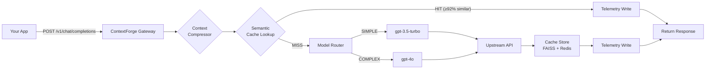

<p align="center">
  
</p>

<h1 align="center">ContextForge</h1>

<p align="center">
  <strong>Cut your LLM API costs by up to 60% — with zero code changes.</strong><br/>
  A drop-in proxy that adds semantic caching, smart model routing, and context compression<br/>
  to any OpenAI-compatible application.
</p>

<p align="center">
  <a href="https://github.com/Ayush-o1/contextforge/actions/workflows/ci.yml"></a>
  
  
  
  
</p>

---

## Table of Contents

- [Why ContextForge?](#why-contextforge)
- [How It Works](#how-it-works)
- [Quick Start](#quick-start)
- [Demo](#demo)
- [Dashboard](#dashboard)
- [Configuration](#configuration)
- [API Overview](#api-overview)
- [Tech Stack](#tech-stack)
- [Project Structure](#project-structure)
- [Testing](#testing)
- [Benchmarks](#benchmarks)
- [Roadmap](#roadmap)
- [Documentation](#documentation)
- [Contributors](#contributors)
- [Contributing](#contributing)
- [License](#license)
- [Contact](#contact)

---

## Why ContextForge?

Most LLM-powered apps send every prompt to the most expensive model, even when a cached answer or a cheaper model would work just fine. ContextForge fixes that — transparently.

Point your app at `localhost:8000` instead of `api.openai.com`. Same SDK, same API, same code. Behind the scenes, ContextForge applies three cost-saving optimizations before anything hits a paid API:

|  | Without ContextForge | With ContextForge |
|--|----------------------|-------------------|
| **Cost per request** | Full price, every time | Cached hits are **free**, simple prompts routed to cheaper models |
| **Latency on repeat queries** | 500ms–2s (full API round-trip) | **< 30ms** from local cache |
| **Code changes needed** | — | **Zero** — just change the base URL |
| **Model flexibility** | Hardcoded in your app | Automatic: simple → GPT-3.5, complex → GPT-4o |
| **Vendor lock-in** | Tied to one provider | Swap models or providers via config |

---

## How It Works




1. **Your app sends a request** — exactly like it would to OpenAI. No SDK changes, no wrapper code.
2. **Context compression** — if the conversation exceeds the token threshold (default: 2,000 tokens) and has enough turns (default: 6), older messages are summarized to reduce token usage. Skipped for short conversations or when `X-ContextForge-No-Compress: true` is set.
3. **Semantic cache lookup** — the prompt is embedded using `all-MiniLM-L6-v2` and searched against a FAISS index. If a match is found at ≥92% cosine similarity, the cached response is returned in under 30ms.
4. **Smart model routing** — on cache miss, a rule-based classifier analyzes token count and keyword signals. Simple prompts go to cheaper models; complex prompts go to the best available.
5. **Upstream call** — the request is forwarded to the selected model via the official SDK.
6. **Cache store** — the response is embedded and stored in FAISS + Redis for future lookups.
7. **Telemetry** — every request is logged to a local SQLite database with model, latency, cost, cache hit status, and compression info. No data leaves your machine.
8. **Response returned** — your app receives a standard OpenAI-compatible response with extra diagnostic headers.

---

## Quick Start

### Option A: Docker (recommended)

```bash
# Clone the repository
git clone https://github.com/Ayush-o1/contextforge.git
cd contextforge

# Configure environment
cp .env.example .env
nano .env   # add your OPENAI_API_KEY

# Start the services
docker compose up --build -d

# Verify
curl http://localhost:8000/health
# → {"status":"ok","version":"0.7.0"}
```

### Option B: Local Development

```bash
# Clone and set up
git clone https://github.com/Ayush-o1/contextforge.git
cd contextforge

# Create a virtual environment
python -m venv .venv
source .venv/bin/activate

# Install dependencies
pip install -r requirements.txt

# Configure environment
cp .env.example .env
# Add your OPENAI_API_KEY to .env

# Start Redis (required)
docker run -d -p 6379:6379 redis:7-alpine

# Run the server
uvicorn app.main:app --host 0.0.0.0 --port 8000
```

### Use It

```python
import openai

client = openai.OpenAI(
    base_url="http://localhost:8000/v1",
    api_key="your-openai-key",
)

response = client.chat.completions.create(
    model="gpt-3.5-turbo",
    messages=[{"role": "user", "content": "What is the capital of France?"}],
)

print(response.choices[0].message.content)
```

That's it. Your existing code works unchanged — just swap the base URL.

---

## Demo

```bash
# First request — cache miss, routed to gpt-3.5-turbo
$ curl -s -D- http://localhost:8000/v1/chat/completions \
  -H "Content-Type: application/json" \
  -H "Authorization: Bearer $OPENAI_API_KEY" \
  -d '{"model":"gpt-3.5-turbo","messages":[{"role":"user","content":"What is the capital of France?"}]}' \
  2>&1 | grep -E "^(X-|HTTP)"

HTTP/1.1 200 OK
X-Cache-Hit: false
X-Model-Tier: simple
X-Model-Selected: gpt-3.5-turbo

# Same question, different wording — instant cache hit
$ curl -s -D- http://localhost:8000/v1/chat/completions \
  -H "Content-Type: application/json" \
  -H "Authorization: Bearer $OPENAI_API_KEY" \
  -d '{"model":"gpt-3.5-turbo","messages":[{"role":"user","content":"What'\''s the capital of France?"}]}' \
  2>&1 | grep -E "^(X-|HTTP)"

HTTP/1.1 200 OK
X-Cache-Hit: true          ← semantically matched (different wording, same meaning)
X-Model-Tier: simple
X-Model-Selected: gpt-3.5-turbo

# Complex prompt — automatically routed to gpt-4o
$ curl -s -D- http://localhost:8000/v1/chat/completions \
  -H "Content-Type: application/json" \
  -H "Authorization: Bearer $OPENAI_API_KEY" \
  -d '{"model":"gpt-3.5-turbo","messages":[{"role":"user","content":"Analyze the time complexity of Dijkstra'\''s algorithm with a Fibonacci heap vs binary heap"}]}' \
  2>&1 | grep -E "^(X-|HTTP)"

HTTP/1.1 200 OK
X-Cache-Hit: false
X-Model-Tier: complex       ← automatically detected
X-Model-Selected: gpt-4o    ← upgraded from gpt-3.5-turbo
```

---

## Dashboard

ContextForge includes a telemetry dashboard that visualizes request data in real time.


Open `docs/dashboard/index.html` in your browser. The dashboard auto-detects the backend:
- **Backend running** → shows live data with an "API Connected" badge
- **Backend down** → falls back to mock data for demos

The dashboard shows:
- Total requests, cache hit rate, avg latency, and cost
- Requests over time and model distribution charts
- Full request log with search and filters
- Cache stats and similarity distribution
- Latency, cost, and hit rate trends

For full details, see [docs/DASHBOARD.md](docs/DASHBOARD.md).

---

## Configuration

All settings are managed via environment variables in a `.env` file. Copy `.env.example` to get started:

```bash
cp .env.example .env
```

### Key Variables

| Variable | Description | Default |
|----------|-------------|---------|
| `OPENAI_API_KEY` | Your OpenAI API key | *(required)* |
| `REDIS_URL` | Redis connection string | `redis://localhost:6379` |
| `SIMILARITY_THRESHOLD` | Cosine similarity for cache hits (0.0–1.0) | `0.92` |
| `CACHE_TTL_SECONDS` | Cache entry lifetime | `86400` (24h) |
| `PREFERRED_PROVIDER` | LLM provider: `openai` or `anthropic` | `openai` |
| `LOG_LEVEL` | Logging verbosity | `INFO` |

For the full configuration reference with all variables, see [docs/CONFIGURATION.md](docs/CONFIGURATION.md).

---

## API Overview

ContextForge exposes an OpenAI-compatible API with additional management endpoints.

| Method | Endpoint | Description |
|--------|----------|-------------|
| `POST` | `/v1/chat/completions` | Chat completions (OpenAI-compatible) |
| `GET` | `/health` | Health check |
| `GET` | `/v1/telemetry` | Paginated telemetry records |
| `GET` | `/v1/telemetry/summary` | Aggregated telemetry stats |
| `GET` | `/v1/threshold` | Current adaptive threshold info |
| `POST` | `/v1/threshold/evaluate` | Trigger threshold evaluation |
| `GET` | `/v1/cache/stats` | Cache statistics |
| `DELETE` | `/v1/cache` | Flush entire cache |
| `DELETE` | `/v1/cache/{key}` | Invalidate a specific cache entry |

**Response headers** on `/v1/chat/completions`:

| Header | Description |
|--------|-------------|
| `X-Cache-Hit` | `true` if response came from cache |
| `X-Model-Tier` | `simple` or `complex` |
| `X-Model-Selected` | Model actually used (e.g., `gpt-4o`) |
| `X-Compressed` | `true` if context compression was applied |
| `X-Compression-Ratio` | Ratio of compressed to original tokens |

For full request/response schemas, see [docs/API.md](docs/API.md).

---

## Tech Stack

| Component | Technology | Why |
|-----------|-----------|-----|
| Web framework | **FastAPI** (Python 3.11) | Async-first, OpenAPI auto-docs |
| Embeddings | **all-MiniLM-L6-v2** | CPU-fast, 384-dim, no GPU needed |
| Vector search | **FAISS** (IndexFlatIP) | In-process, zero infra |
| Cache store | **Redis 7** | TTL support, fast KV reads |
| Token counting | **tiktoken** | Model-specific, fast |
| Telemetry | **SQLite** (via SQLModel) | Zero infra, single-file |
| LLM SDK | **openai-python** | Official SDK, version-pinned |
| Config | **Pydantic Settings** + `.env` | Type-safe, validated at startup |
| Logging | **structlog** | Structured JSON logs |
| Testing | **pytest** + **httpx** | Fixture-based, no live API calls |
| Containerization | **Docker** + Docker Compose | One-command deployment |
| Linting | **ruff** | Fast, replaces flake8 + isort |

---

## Project Structure

```
contextforge/
├── app/
│   ├── main.py              # FastAPI app, lifespan, all endpoints
│   ├── proxy.py             # Upstream forwarding via OpenAI SDK
│   ├── models.py            # Pydantic request/response schemas
│   ├── config.py            # Pydantic Settings (loads .env)
│   ├── cache.py             # Semantic cache (FAISS + Redis)
│   ├── embedder.py          # Sentence-transformer embedding wrapper
│   ├── vector_store.py      # FAISS index with thread-safe writes
│   ├── router.py            # Rule-based complexity classifier
│   ├── compressor.py        # Context compression (summarization)
│   ├── costs.py             # Per-model cost estimation
│   ├── telemetry.py         # SQLite telemetry (WAL mode)
│   ├── adaptive.py          # Adaptive threshold manager
│   └── middleware.py        # Request wrapping middleware
├── config/
│   └── routing_rules.yaml   # Token thresholds, keywords, model mappings
├── tests/
│   ├── conftest.py          # Shared fixtures (mock Redis, FAISS, etc.)
│   ├── test_proxy.py        # 12 tests — health, completions, streaming, errors
│   ├── test_cache.py        # 14 tests — VectorStore, SemanticCache, endpoints
│   ├── test_router.py       # 18 tests — classifier, 1000-prompt accuracy
│   ├── test_compressor.py   # 5 tests — token counting, thresholds, fallback
│   ├── test_telemetry.py    # 5 tests — write/read, summary, cost, dedup
│   ├── test_adaptive.py     # 8 tests — threshold tuning, caps, endpoints
│   ├── test_cache_invalidation.py  # 7 tests — flush, invalidate, stats
│   └── test_benchmarks.py   # 15 tests — paraphrase, latency, accuracy
├── benchmarks/
│   ├── run_benchmark.py     # E2E benchmark runner
│   ├── benchmark_utils.py   # Paraphrase, latency stats, accuracy
│   └── prompts_labeled.json # 1000 labeled prompts for testing
├── docs/
│   ├── ARCHITECTURE.md      # System design and component diagram
│   ├── API.md               # Full API reference
│   ├── CONFIGURATION.md     # Environment variable reference
│   ├── DASHBOARD.md         # Dashboard architecture and guide
│   ├── HANDOFF.md           # Developer onboarding guide
│   ├── SETUP.md             # Local development setup
│   ├── TROUBLESHOOTING.md   # Common issues and fixes
│   ├── assets/              # Screenshots and diagrams
│   └── dashboard/           # Interactive telemetry dashboard (static)
│       ├── index.html
│       ├── css/style.css
│       └── js/{app,charts,data,tables,ui}.js
├── .github/workflows/
│   └── ci.yml               # GitHub Actions: lint + test + benchmark
├── docker-compose.yml       # App + Redis services
├── Dockerfile               # Python 3.11 container
├── requirements.txt         # Pinned Python dependencies
├── .env.example             # Environment variable template
├── DECISIONS.md             # Architecture Decision Records
├── CHANGELOG.md             # Version history
├── CONTRIBUTING.md          # Contribution guidelines
├── CODE_OF_CONDUCT.md       # Community standards
├── SECURITY.md              # Security policy
└── LICENSE                  # MIT License
```

---

## Testing

```bash
# Run lint check
ruff check app/ tests/ benchmarks/

# Run all tests
PYTHONPATH=. pytest tests/ -v
```

| Test File | Tests | Coverage |
|-----------|:-----:|----------|
| `test_proxy.py` | 12 | Health check, completions, streaming SSE, error propagation (429/500/502) |
| `test_cache.py` | 14 | VectorStore CRUD, SemanticCache hit/miss, Redis TTL, FAISS-Redis sync |
| `test_router.py` | 18 | Classifier unit tests, ≥85% accuracy on 1000-prompt dataset, override header |
| `test_compressor.py` | 5 | Token counting, min turns check, compression, error fallback, system messages |
| `test_telemetry.py` | 5 | Write/read roundtrip, summary, cost estimation, dedup, total requests |
| `test_adaptive.py` | 8 | Threshold raise/lower/unchanged, min/max caps, DB write, endpoints |
| `test_cache_invalidation.py` | 7 | Flush, invalidate, stats, idempotent flush, endpoint schemas |
| `test_benchmarks.py` | 15 | Paraphrase, latency stats (p50/p95/p99), routing accuracy, confusion matrix |

> **84/84 tests pass** without any live API calls or running services.

---

## Benchmarks

ContextForge includes an E2E benchmarking suite that measures cache hit rates, routing accuracy, and latency percentiles.

```bash
# Full benchmark (requires running server + Redis)
python benchmarks/run_benchmark.py

# Dry-run mode (no server required, safe for CI)
python benchmarks/run_benchmark.py --dry-run
```

| Metric | Threshold | Description |
|--------|-----------|-------------|
| Routing accuracy | ≥ 85% | Prompts correctly classified as simple/complex |
| p95 latency | ≤ 5,000ms | 95th percentile response time |
| Cache hit rate | ≥ 40% | Paraphrased replays served from cache |

See [benchmarks/README.md](benchmarks/README.md) for full details.

---

## Roadmap

| Phase | Feature | Status |
|:-----:|---------|:------:|
| 0 | Architecture & Repo Setup | ✅ Complete |
| 1 | Core Proxy (Passthrough) | ✅ Complete |
| 2 | Semantic Cache | ✅ Complete |
| 3 | Model Router | ✅ Complete |
| 4 | Context Compressor | ✅ Complete |
| 5 | Telemetry Layer | ✅ Complete |
| 6 | Adaptive Thresholds & Cache Invalidation | ✅ Complete |
| 7 | Testing & Benchmarking Harness | ✅ Complete |
| 8 | Dockerization & Dashboard | ✅ Complete |
| 9 | Final Documentation & Handoff | ✅ Complete |

> **v0.8.0** · 84/84 tests passing · ruff clean · modular dashboard · production docs

---

## Documentation

| Document | Description |
|----------|-------------|
| [Setup Guide](docs/SETUP.md) | Local development setup — prerequisites, install, run |
| [Architecture](docs/ARCHITECTURE.md) | System design, request pipeline, component diagram |
| [API Reference](docs/API.md) | Full endpoint documentation with request/response schemas |
| [Dashboard](docs/DASHBOARD.md) | Dashboard architecture, pages, element IDs, dev guide |
| [Configuration](docs/CONFIGURATION.md) | Complete environment variable reference |
| [Troubleshooting](docs/TROUBLESHOOTING.md) | Common issues and fixes |
| [Handoff Guide](docs/HANDOFF.md) | Developer onboarding — gotchas, file map |
| [Decisions](DECISIONS.md) | Architecture Decision Records (ADR-001 to ADR-004) |
| [Changelog](CHANGELOG.md) | Version history (v0.0.1 → v0.8.0) |
| [Contributing](CONTRIBUTING.md) | Development setup, branch strategy, PR process |

---

## Contributors

Thanks to everyone who has contributed to ContextForge.

<table>
  <tr>
    <td align="center">
      <a href="https://github.com/Ayush-o1">
        
        <br />
        <sub><b>Ayush Kumar</b></sub>
      </a>
      <br />
      <sub>Creator & Maintainer</sub>
    </td>
    <td align="center">
      <a href="https://github.com/Anubhav104401">
        
        <br />
        <sub><b>Anubhav</b></sub>
      </a>
      <br />
      <sub>Contributor</sub>
    </td>
    <td align="center">
      <a href="https://github.com/Astik01">
        
        <br />
        <sub><b>Astik</b></sub>
      </a>
      <br />
      <sub>Contributor</sub>
    </td>
  </tr>
</table>

<!-- To add a new contributor: copy a <td> block above, update the GitHub username,
     image URL (https://github.com/USERNAME.png), display name, and role. -->

---

## Contributing

We welcome contributions of all kinds — code, documentation, bug reports, and feature ideas.

Please read [CONTRIBUTING.md](CONTRIBUTING.md) before getting started. It covers:
- Development setup
- Code style and linting
- Testing guidelines
- Branch naming and PR process

---

## License

This project is licensed under the MIT License. See [LICENSE](LICENSE) for details.

---

## Contact

- **Maintainer:** [Ayush Kumar](https://github.com/Ayush-o1)
- **Email:** ayushh.ofc10@gmail.com
- **Issues:** [GitHub Issues](https://github.com/Ayush-o1/contextforge/issues)

---

<p align="center">
  <sub>Built for developers who are tired of overpaying for LLM APIs.</sub>
</p>
