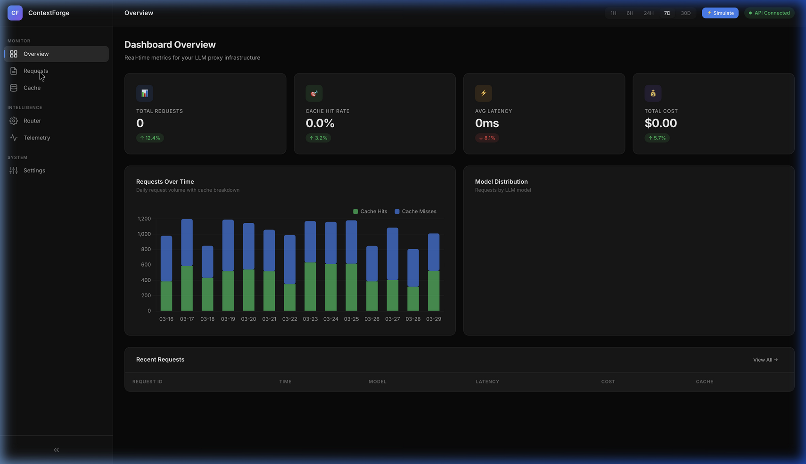
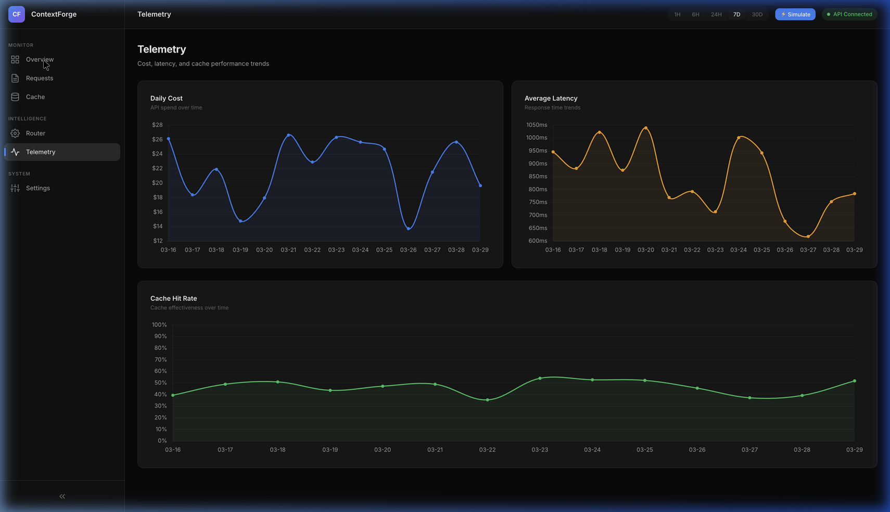

# ContextForge Dashboard

> Real-time monitoring dashboard for the ContextForge LLM proxy.

---

## Overview

The dashboard is a standalone static web application located at `docs/dashboard/`. It visualizes telemetry data from the ContextForge backend in real time and falls back to mock data when the backend is unavailable.



---

## How to Open

**Option A — Open directly in your browser:**

```
docs/dashboard/index.html
```

The dashboard auto-detects the backend. If `http://localhost:8000/health` responds, it shows live data. Otherwise, it shows mock data with a "Using Mock Data" badge.

**Option B — File URL:**

```
file:///path/to/contextforge/docs/dashboard/index.html
```

> **Note:** The dashboard is a static site. It does not need a web server — just open the HTML file.

---

## Pages

| Page | What It Shows |
|------|--------------|
| **Overview** | Metric cards (total requests, cache hit rate, avg latency, total cost), requests-over-time chart, model distribution doughnut, recent requests table |
| **Requests** | Full request log with search, model filter, cache status filter, tier filter, pagination |
| **Cache** | Cache stats (entries, memory, hit rate, avg similarity), similarity distribution chart, cache entries table |
| **Router** | Accuracy ring, routing categories table, model assignment chart |
| **Telemetry** | Daily cost trend, average latency trend, cache hit rate trend (all as line charts) |
| **Settings** | API URL, cache TTL, similarity threshold, max tokens configuration |

---

## Backend API Endpoints

The dashboard fetches data from these backend endpoints:

| Endpoint | Used For |
|----------|----------|
| `GET /health` | Connection detection (API Connected / Mock Data) |
| `GET /v1/telemetry?limit=50` | Request records for tables |
| `GET /v1/telemetry/summary` | Metric cards (total requests, hit rate, latency, cost) |
| `GET /v1/cache/stats` | Cache statistics |

---

## Architecture

The dashboard is built with vanilla HTML, CSS, and JavaScript — no build tools, no frameworks.

```
docs/dashboard/
├── index.html          # Shell: sidebar, header, all page sections
├── css/
│   └── style.css       # Complete design system (dark theme, components)
└── js/
    ├── data.js         # Mock data + API connection check
    ├── ui.js           # Toast, modal, sidebar, formatters, clipboard
    ├── charts.js       # Chart.js chart initialization (6 charts)
    ├── tables.js       # Table rendering, pagination, filters
    └── app.js          # Page navigation, data loading, normalization
```

### Data Flow

```
1. app.js → init()
2.   → checkAPIConnection()     (ui.js → GET /health)
3.   → loadData()
4.     → If connected: fetch summary + telemetry + cache stats
5.       → normalizeRequest(r) + _normalizeApiRecord(r)
6.     → If disconnected: use mock data from data.js
7.   → navigateTo('overview')
8.     → initOverviewPage() → charts.js + tables.js render
```

### Key Design Decisions

- **No framework**: Keeps the dashboard zero-dependency and instant-loading
- **Mock fallback**: Works offline for demos and development
- **Normalization layer**: `normalizeRequest()` and `_normalizeApiRecord()` in app.js translate backend field names to the frontend schema
- **Chart.js**: All 6 charts use Chart.js 4.x loaded from CDN
- **Dark theme**: Premium dark UI with glassmorphism effects

---

## Element IDs

These IDs are used by the test suite and JavaScript modules. Do not rename them:

| ID | Element |
|----|---------|
| `req-tbody` | Request log table body |
| `cache-tbody` | Cache entries table body |
| `router-tbody` | Router categories table body |
| `recent-tbody` | Recent requests table body (overview) |
| `chart-requests` | Requests over time canvas |
| `chart-models` | Model distribution canvas |
| `chart-similarity` | Similarity distribution canvas |
| `chart-latency` | Latency trend canvas |
| `chart-cost` | Cost trend canvas |
| `chart-hitrate` | Hit rate trend canvas |
| `clear-cache-btn` | Clear cache button |
| `req-search` | Request search input |
| `cache-filter` | Cache filter select |
| `tier-filter` | Tier filter select |
| `export-btn` | Export CSV button |
| `simulate-btn` | Simulate request button |
| `conn-badge` | Connection status badge |
| `sidebar-toggle` | Sidebar collapse button |
| `toast-container` | Toast notification container |

---

## Telemetry Charts



The Telemetry page shows three trend charts:
- **Daily Cost** — API spend over time (line + area)
- **Average Latency** — Response time trends (line + area)
- **Cache Hit Rate** — Cache effectiveness over time (line + area, 0–100%)

---

## Development

### Modifying the Dashboard

1. Edit files directly in `docs/dashboard/`
2. Refresh the browser — no build step needed
3. If adding new element IDs, update the table above

### Adding a New Page

1. Add a `<section id="page-yourpage" class="page">` in `index.html`
2. Add a nav item in the sidebar with `data-page="yourpage"`
3. Add a case in `navigateTo()` in `app.js`
4. Create an `initYourPage(data)` function

### Adding a New Chart

1. Add a `<canvas id="chart-yourname">` in the page section
2. Create an `initYourNameChart(data)` function in `charts.js`
3. Call it from the page initializer in `app.js`
4. Register it in the `_charts` object for cleanup on page change
